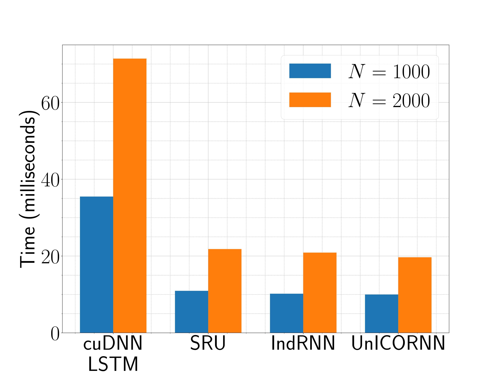

<h1 align='center'> UnICORNN <br>(Undamped Independent Controlled Oscillatory RNN) <br> [ICML 2021] </h1>

This repository contains the implementation to reproduce the numerical experiments 
of the **ICML 2021** paper [UnICORNN: A recurrent model for learning very long time dependencies](http://proceedings.mlr.press/v139/rusch21a.html)


## Requirements
This code runs on GPUs only, as the recurrent part of UnICORNN is implemented directly in CUDA. The CUDA extension is compiled using pynvrtc. Make sure all of the packages below are installed.
```bash
python 3.7.4
cupy 7.6.0
pynvrtc 9.2
pytorch 1.5.1+cu101 
torchvision 0.6.1+cu101
torchtext 0.6.0
numpy 1.17.3
spacy 2.3.2
```

## Speed

The recurrent part of UnICORNN is directly implemented in pure CUDA (as a PyTorch extension to the remaining standard PyTorch code), where each dimension of the underlying dynamical system is computed on an independent CUDA thread.
This leads to an amazing speed-up over using PyTorch on GPUs directly (depending on the data set around 30-50 times faster). 
Below is a speed comparison of our UnICORNN implementation to the fastest RNN implementations you can find (the set-up of this benchmark can be found in the main paper):

<p align="center">

</p>


## Datasets

This repository contains the codes to reproduce the results of the following experiments for the proposed UnICORNN:

  - **Permuted Sequential MNIST** 
  - **Noise-padded CIFAR10** 
  - **EigenWorms** 
  - **Healthcare AI: Respiratory rate (RR)**
  - **Healthcare AI: Heart rate (HR)**
  - **IMDB**

## Results
The results of the UnICORNN for each of the experiments are:
<table>
  <tr>
    <td> Experiment </td>
    <td> Result </td>
  </tr>
  <tr>
    <td>psMNIST </td>
    <td> 98.4% test accuracy</td>
  </tr>
  <tr>
    <td>Noise-padded CIFAR10 </td>
    <td> 62.4% test accuarcy </td>
  </tr>
    <tr>
    <td>Eigenworms</td>
    <td> 94.9% test accuracy </td>
  </tr>
  <tr>
    <td>Healthcare AI: RR</td>
    <td> 1.00 L2 loss </td>
  </tr>
  <tr>
    <td>Healthcare AI: HR</td>
    <td> 1.31 L2 loss  </td>
  </tr>
  <tr>
    <td>IMDB</td>
    <td> 88.4% test accuracy </td>
  </tr>
</table>


## Citation
If you found this work useful, please consider citing
```bibtex
@inproceedings{pmlr-v139-rusch21a,
  title = 	 {UnICORNN: A recurrent model for learning very long time dependencies},
  author =       {Rusch, T. Konstantin and Mishra, Siddhartha},
  booktitle = 	 {Proceedings of the 38th International Conference on Machine Learning},
  pages = 	 {9168--9178},
  year = 	 {2021},
  volume = 	 {139},
  series = 	 {Proceedings of Machine Learning Research},
  publisher =    {PMLR},
}
```


